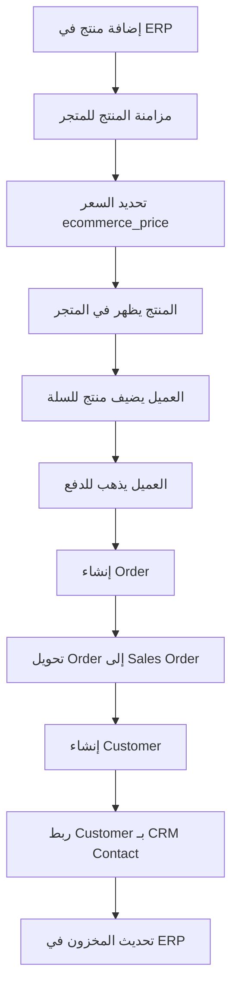

# دليل استخدام المتجر الإلكتروني (E-Commerce Store)

## نظرة عامة

نظام E-Commerce متكامل مع ERP يسمح بإنشاء متاجر إلكترونية متعددة لكل tenant، مع مزامنة تلقائية للمنتجات من نظام ERP، وإدارة كاملة للطلبات والعملاء.

---

## الفهرس

1. [الصلاحيات والأدوار](#الصلاحيات-والأدوار)
2. [إعداد المتجر](#إعداد-المتجر)
3. [إضافة المنتجات](#إضافة-المنتجات)
4. [التسعير](#التسعير)
5. [إدارة القوالب](#إدارة-القوالب)
6. [إدارة الصفحات](#إدارة-الصفحات)
7. [الطلبات](#الطلبات)
8. [العملاء](#العملاء)
9. [الوصول للمتجر](#الوصول-للمتجر)
10. [تدفق العمل الكامل](#تدفق-العمل-الكامل)

---

## الصلاحيات والأدوار

### الصلاحيات المطلوبة

النظام يستخدم نظام permissions محدد. الصلاحيات المطلوبة:

#### إدارة المتاجر (Stores)
- `ecommerce.stores.view` - عرض المتاجر
- `ecommerce.stores.viewAny` - عرض قائمة المتاجر
- `ecommerce.stores.create` - إنشاء متجر جديد
- `ecommerce.stores.update` - تحديث المتجر
- `ecommerce.stores.delete` - حذف المتجر

#### إدارة القوالب (Themes)
- `ecommerce.themes.view` - عرض القوالب
- `ecommerce.themes.viewAny` - عرض قائمة القوالب
- `ecommerce.themes.create` - إنشاء قالب جديد
- `ecommerce.themes.update` - تحديث القالب
- `ecommerce.themes.delete` - حذف القالب

#### إدارة الطلبات (Orders)
- `ecommerce.orders.view` - عرض الطلبات
- `ecommerce.orders.viewAny` - عرض قائمة الطلبات
- `ecommerce.orders.update` - تحديث حالة الطلب

#### إدارة المنتجات (Product Sync)
- `ecommerce.stores.view` - عرض حالة المزامنة
- `ecommerce.stores.update` - مزامنة/إلغاء مزامنة المنتجات

#### إدارة الصفحات (Pages)
- `ecommerce.pages.view` - عرض الصفحات
- `ecommerce.pages.viewAny` - عرض قائمة الصفحات
- `ecommerce.pages.create` - إنشاء صفحة
- `ecommerce.pages.update` - تحديث الصفحة
- `ecommerce.pages.delete` - حذف الصفحة

#### إدارة كتل المحتوى (Content Blocks)
- `ecommerce.content_blocks.view` - عرض كتل المحتوى
- `ecommerce.content_blocks.viewAny` - عرض قائمة كتل المحتوى
- `ecommerce.content_blocks.create` - إنشاء كتلة محتوى
- `ecommerce.content_blocks.update` - تحديث كتلة المحتوى
- `ecommerce.content_blocks.delete` - حذف كتلة المحتوى

### من يجب أن يملك صلاحيات الإدارة؟

#### Tenant Owner (Super Admin)
- **يحصل تلقائياً على جميع الصلاحيات** بما فيها E-Commerce
- يمكنه إدارة جميع جوانب المتجر
- يتم تعيين الصلاحيات تلقائياً عند إنشاء Tenant

#### مدير المتجر (Store Manager)
- يحتاج: جميع صلاحيات `ecommerce.stores.*` و `ecommerce.orders.*`
- المسؤوليات: إدارة المتاجر، الطلبات، المنتجات

#### مصمم المتجر (Store Designer)
- يحتاج: `ecommerce.themes.*` و `ecommerce.pages.*`
- المسؤوليات: تصميم القوالب، إنشاء الصفحات

#### مدير المنتجات (Product Manager)
- يحتاج: `ecommerce.stores.view` و `ecommerce.stores.update`
- المسؤوليات: مزامنة المنتجات، إدارة الأسعار

#### مدير الطلبات (Order Manager)
- يحتاج: `ecommerce.orders.view` و `ecommerce.orders.update`
- المسؤوليات: متابعة الطلبات، تحديث الحالات

### كيفية تعيين الصلاحيات

1. الانتقال إلى **Roles & Permissions** في لوحة التحكم
2. إنشاء Role جديد أو تعديل Role موجود
3. تعيين الصلاحيات المطلوبة من قائمة E-Commerce permissions
4. حفظ التغييرات

---

## إعداد المتجر

### الخطوة 1: إنشاء متجر جديد

1. تسجيل الدخول كـ Tenant Owner أو مستخدم لديه صلاحيات `ecommerce.stores.create`
2. الانتقال إلى **E-Commerce > Stores**
3. النقر على **Create Store** أو **إضافة متجر جديد**
4. إدخال البيانات الأساسية:
   - **Name**: اسم المتجر (مثال: "متجر الشركة الرئيسي")
   - **Slug**: رابط المتجر (مثال: "main-store") - يتم توليده تلقائياً إذا لم يتم تحديده
   - **Domain**: النطاق الخاص (اختياري)
   - **Description**: وصف المتجر
   - **Logo**: شعار المتجر (URL)
   - **Favicon**: أيقونة المتجر (URL)

### الخطوة 2: اختيار القالب

1. في صفحة إنشاء/تعديل المتجر
2. اختيار **Theme** من القائمة المنسدلة
3. القوالب المتاحة:
   - **Modern Minimal** - تصميم عصري بسيط (افتراضي)
   - **Classic Shop** - متجر تقليدي
   - **Bold Commerce** - تصميم جريء

### الخطوة 3: إعدادات المتجر

في حقل **Settings** (JSON)، يمكن إضافة:

```json
{
  "currency": "USD",
  "language": "ar",
  "tax_rate": 0.15,
  "shipping_enabled": true,
  "payment_methods": ["stripe", "paypal", "bank_transfer"]
}
```

### الخطوة 4: تفعيل المتجر

- تأكد من تفعيل **Is Active** لتفعيل المتجر
- حفظ المتجر

### الوصول للمتجر

بعد إنشاء المتجر، يمكن الوصول إليه عبر:
- **URL**: `/storefront/{store-slug}`
- مثال: `/storefront/main-store`

---

## إضافة المنتجات

### المبدأ الأساسي

**المنتجات تأتي من ERP فقط** - لا يمكن إضافة منتجات مباشرة في المتجر. يجب إضافتها أولاً في **ERP > Products**.

### الخطوة 1: إضافة المنتجات في ERP

1. الانتقال إلى **ERP > Products**
2. إنشاء منتج جديد أو استخدام منتج موجود
3. التأكد من أن المنتج **نشط** (`is_active = true`)

### الخطوة 2: مزامنة المنتجات للمتجر

#### الطريقة 1: مزامنة منتج واحد

1. الانتقال إلى **E-Commerce > Products**
2. اختيار المتجر من القائمة المنسدلة
3. البحث عن المنتج من قائمة ERP Products
4. النقر على **Sync** أو **Add to Store**
5. إدخال المعلومات:
   - **E-Commerce Price**: السعر في المتجر (مطلوب)
   - **E-Commerce Description**: وصف خاص بالمتجر (اختياري)
   - **E-Commerce Images**: صور خاصة بالمتجر (JSON array) (اختياري)
   - **Store Visibility**: إظهار/إخفاء في المتجر (افتراضي: true)
   - **Sort Order**: ترتيب العرض (افتراضي: 0)

#### الطريقة 2: مزامنة جميع المنتجات النشطة

1. الانتقال إلى **E-Commerce > Products**
2. اختيار المتجر من القائمة المنسدلة
3. النقر على **Sync All Products**
4. سيتم مزامنة جميع المنتجات النشطة (`is_active = true`) تلقائياً
5. **ملاحظة**: يجب تحديد الأسعار لاحقاً لكل منتج

#### الطريقة 3: المزامنة التلقائية

- عند تحديث منتج في ERP:
  - إذا أصبح المنتج غير نشط (`is_active = false`)، يتم إخفاؤه تلقائياً من جميع المتاجر
  - يتم تحديث حالة المزامنة عبر `ProductObserver`

### جدول المزامنة (ProductSync)

الجدول: `ecommerce_product_sync`

الحقول المهمة:
- `product_id` - المنتج من ERP
- `store_id` - المتجر
- `is_synced` - حالة المزامنة (true/false)
- `store_visibility` - إظهار في المتجر (true/false)
- `ecommerce_price` - السعر في المتجر (**هذا هو السعر المعروض**)
- `ecommerce_images` - صور خاصة بالمتجر (JSON array)
- `ecommerce_description` - وصف خاص بالمتجر
- `sort_order` - ترتيب العرض

---

## التسعير

### أين يتم التسعير؟

**في جدول ProductSync**

الحقل: `ecommerce_price` في جدول `ecommerce_product_sync`

### المميزات

- كل متجر يمكنه أن يكون له سعر مختلف لنفس المنتج
- السعر محفوظ في `ProductSync` وليس في `Product`
- إذا لم يتم تحديد سعر، يتم استخدام 0 كقيمة افتراضية

### كيفية تحديد السعر

#### عند المزامنة:
1. عند مزامنة منتج، يمكن تحديد `ecommerce_price`
2. إذا لم يتم تحديده، يمكن تحديثه لاحقاً

#### تحديث السعر:
1. الانتقال إلى **E-Commerce > Products**
2. اختيار المتجر
3. البحث عن المنتج
4. النقر على **Edit** أو **Update**
5. تحديث حقل **E-Commerce Price**
6. حفظ التغييرات

### مثال على التسعير

```php
// منتج في ERP بسعر 100
Product: name="Laptop", price=100

// نفس المنتج في متجرين بسعرين مختلفين
Store 1: ecommerce_price = 120 (سعر أعلى)
Store 2: ecommerce_price = 95 (سعر أقل)
```

---

## إدارة القوالب

### القوالب الافتراضية

النظام يحتوي على 3 قوالب افتراضية:

1. **Modern Minimal**
   - ألوان: أبيض، رمادي فاتح، أزرق (#3B82F6)
   - Layout: Header + Hero + Products Grid + Footer
   - مناسب للشركات الحديثة

2. **Classic Shop**
   - ألوان: بني (#8B4513)، كريمي (#D2B48C)، ذهبي
   - Layout: Sidebar Categories + Products List
   - مناسب للمتاجر التقليدية

3. **Bold Commerce**
   - ألوان: أسود (#000000)، أحمر (#DC2626)، أبيض
   - Layout: Full-width sections + Large images
   - مناسب للمتاجر الجريئة

### إنشاء قالب جديد

1. الانتقال إلى **E-Commerce > Themes**
2. النقر على **Create Theme**
3. إدخال البيانات:
   - **Name**: اسم القالب
   - **Slug**: رابط القالب
   - **Description**: وصف القالب
   - **Config**: إعدادات القالب (JSON)
     ```json
     {
       "colors": {
         "primary": "#3B82F6",
         "secondary": "#64748B",
         "background": "#FFFFFF",
         "text": "#1E293B"
       },
       "typography": {
         "fontFamily": "Inter",
         "headingSize": "2rem"
       },
       "layout": {
         "header": {...},
         "footer": {...}
       }
     }
     ```
4. حفظ القالب

### تطبيق قالب على متجر

1. الانتقال إلى **E-Commerce > Stores**
2. اختيار المتجر
3. النقر على **Edit**
4. اختيار **Theme** من القائمة المنسدلة
5. حفظ التغييرات

---

## إدارة الصفحات

### إنشاء صفحة جديدة

1. الانتقال إلى **E-Commerce > Pages**
2. النقر على **Create Page**
3. إدخال البيانات:
   - **Title**: عنوان الصفحة
   - **Slug**: رابط الصفحة (مثال: "about-us")
   - **Content**: محتوى الصفحة (JSON - من Page Builder)
   - **Meta**: معلومات SEO (JSON)
   - **Is Published**: نشر/إخفاء الصفحة

### استخدام Page Builder

1. في صفحة إنشاء/تعديل الصفحة
2. النقر على **Open Page Builder**
3. سحب وإفلات الكتل من الشريط الجانبي
4. تعديل محتوى كل كتلة
5. حفظ الصفحة

### أنواع الكتل المتاحة

- **Text Block** - نص قابل للتعديل
- **Image Block** - صورة مع caption
- **Products Grid** - شبكة منتجات
- **Hero Section** - قسم رئيسي كبير
- **Video Block** - فيديو
- **HTML Block** - HTML مخصص
- **Form Block** - نموذج اتصال

### الوصول للصفحة

بعد نشر الصفحة، يمكن الوصول إليها عبر:
- **URL**: `/storefront/{store-slug}/pages/{page-slug}`
- مثال: `/storefront/main-store/pages/about-us`

---

## الطلبات

### عرض الطلبات

1. الانتقال إلى **E-Commerce > Orders**
2. عرض قائمة جميع الطلبات
3. يمكن التصفية حسب:
   - المتجر
   - الحالة (pending, processing, shipped, delivered, cancelled)
   - حالة الدفع (pending, paid, failed)

### تفاصيل الطلب

1. النقر على أي طلب لعرض التفاصيل
2. المعلومات المعروضة:
   - رقم الطلب
   - معلومات العميل
   - المنتجات المطلوبة
   - العنوان للشحن
   - طريقة الدفع
   - حالة الطلب
   - **Sales Order ID** (الطلب المرتبط في ERP)

### تحديث حالة الطلب

1. في صفحة تفاصيل الطلب
2. النقر على **Update Status**
3. اختيار الحالة الجديدة:
   - **pending** - قيد الانتظار
   - **processing** - قيد المعالجة
   - **shipped** - تم الشحن
   - **delivered** - تم التسليم
   - **cancelled** - ملغي
   - **refunded** - مسترد

### ربط الطلب بـ ERP

- عند إنشاء طلب في المتجر، يتم **تحويله تلقائياً** إلى Sales Order في ERP
- يمكن رؤية Sales Order المرتبط في صفحة تفاصيل الطلب
- تحديث حالة Sales Order في ERP يحدث حالة الطلب في المتجر تلقائياً

---

## العملاء

### أنواع العملاء

#### 1. العملاء الضيوف (Guest Customers)

- لا يحتاجون حساب في المتجر
- يستخدمون **Session ID** للتعريف
- يتم إنشاء Customer تلقائياً عند الطلب
- يتم ربطهم بـ CRM Contact عند تحويل الطلب إلى Sales Order

#### 2. العملاء المسجلين (Registered Customers)

- لديهم حساب في المتجر
- يمكنهم تسجيل الدخول
- يتم حفظ معلوماتهم (email, name, phone, addresses)
- يتم ربطهم تلقائياً بـ CRM Contact عند إنشاء أول طلب

### إدارة العملاء

**الموقع**: يمكن رؤية العملاء من خلال **E-Commerce > Orders**

المعلومات المحفوظة:
- **Email** (فريد لكل متجر)
- **Name**
- **Phone**
- **Addresses** (JSON - billing & shipping)
- **Password** (للمسجلين فقط)
- **Contact ID** (ربط مع CRM)

### ربط العملاء بـ CRM

- عند إنشاء طلب، يتم **إنشاء Customer تلقائياً**
- يتم **ربط Customer بـ CRM Contact تلقائياً** عند تحويل الطلب إلى Sales Order
- إذا كان Customer لديه Contact موجود، يتم استخدامه
- إذا لم يكن موجوداً، يتم إنشاء Contact جديد

---

## الوصول للمتجر

### URL المتجر

- **الصفحة الرئيسية**: `/storefront/{store-slug}`
- **قائمة المنتجات**: `/storefront/{store-slug}/products`
- **تفاصيل المنتج**: `/storefront/{store-slug}/products/{product-id}`
- **السلة**: `/storefront/{store-slug}/cart`
- **الدفع**: `/storefront/{store-slug}/checkout`
- **تأكيد الطلب**: `/storefront/{store-slug}/order-confirmation/{order-id}`

### الوصول العام

- **لا يحتاج تسجيل دخول** للتصفح
- يمكن للعملاء رؤية المنتجات وإضافتها للسلة
- يمكن للعملاء إنشاء طلبات كضيوف

### مثال على الوصول

إذا كان slug المتجر هو `main-store`:
- الصفحة الرئيسية: `http://yourdomain.com/storefront/main-store`
- المنتجات: `http://yourdomain.com/storefront/main-store/products`

---

## تدفق العمل الكامل

### السيناريو الكامل: من المنتج إلى الطلب



### الخطوات التفصيلية

#### 1. إعداد المتجر (Tenant Owner)
- إنشاء متجر جديد
- اختيار قالب
- ضبط الإعدادات

#### 2. إضافة المنتجات
- إضافة المنتجات في ERP
- مزامنة المنتجات للمتجر
- تحديد الأسعار

#### 3. العميل يتصفح المتجر
- الوصول إلى `/storefront/{store-slug}`
- تصفح المنتجات
- إضافة منتجات للسلة

#### 4. إنشاء الطلب
- الذهاب إلى Checkout
- إدخال معلومات الشحن والدفع
- إنشاء الطلب

#### 5. المعالجة التلقائية
- يتم إنشاء Order في E-Commerce
- يتم تحويل Order إلى Sales Order في ERP تلقائياً
- يتم إنشاء Customer تلقائياً
- يتم ربط Customer بـ CRM Contact تلقائياً

#### 6. إدارة الطلب
- متابعة الطلب في E-Commerce > Orders
- تحديث حالة الطلب
- متابعة Sales Order في ERP

---

## نصائح وأفضل الممارسات

### 1. إدارة المنتجات
- **استخدم Sync All** عند إضافة منتجات كثيرة للمرة الأولى
- **حدد الأسعار** فوراً بعد المزامنة
- **راجع Store Visibility** للتأكد من ظهور المنتجات

### 2. إدارة الطلبات
- **راقب الطلبات الجديدة** يومياً
- **حدث حالة الطلبات** بانتظام
- **راجع Sales Orders** في ERP للتأكد من التحويل الصحيح

### 3. إدارة العملاء
- **راجع CRM Contacts** لرؤية العملاء الجدد
- **استخدم معلومات العملاء** لتحسين الخدمة

### 4. الأداء
- **استخدم Sync All** بحذر - قد يستغرق وقتاً للمنتجات الكثيرة
- **راجع Store Visibility** بانتظام لإخفاء المنتجات غير المتوفرة

---

## استكشاف الأخطاء

### المشكلة: المنتجات لا تظهر في المتجر

**الحل:**
1. تأكد من أن المنتج نشط في ERP (`is_active = true`)
2. تأكد من أن المنتج تم مزامنته (`is_synced = true`)
3. تأكد من أن `store_visibility = true`
4. تأكد من أن المتجر نشط (`is_active = true`)

### المشكلة: السعر يظهر 0

**الحل:**
1. تأكد من تحديد `ecommerce_price` في ProductSync
2. راجع صفحة E-Commerce > Products
3. حدث السعر يدوياً

### المشكلة: الطلب لا يتحول إلى Sales Order

**الحل:**
1. راجع logs للتأكد من وجود أخطاء
2. تأكد من أن Order تم إنشاؤه بنجاح
3. راجع `OrderSyncService` في الكود

### المشكلة: Customer لا يربط بـ Contact

**الحل:**
1. راجع `OrderSyncService::convertToSalesOrder()`
2. تأكد من أن Customer تم إنشاؤه
3. راجع جدول `ecommerce_customers` و `contacts`

---

## الخلاصة

نظام E-Commerce متكامل بالكامل مع ERP ويوفر:
- مزامنة تلقائية للمنتجات
- تحويل تلقائي للطلبات
- ربط تلقائي للعملاء
- إدارة كاملة من لوحة التحكم

**البدء السريع:**
1. إنشاء متجر
2. مزامنة المنتجات
3. تحديد الأسعار
4. المتجر جاهز!

---

**تم إنشاء الدليل:** 2026-01-22  
**آخر تحديث:** 2026-01-22


